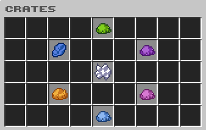

# Crates

<figure><figcaption></figcaption></figure>

Toutes les clés que vous recevrez sont virtuelles.\
\
Le système est super simple à utiliser : \
Clic gauche pour ouvrir 1 clef\
Touche de drop pour ouvrir 5,120 clefs\
Clic droit pour visualiser la crate\

| Commande | Description                                                                  |
| -------- | ---------------------------------------------------------------------------- |
| /key     | Permet d'ouvrir le menu des clés virtuelles où vous pouvez ouvrir vos crates |

&#x20;          \[ ] = optionnel                     < > = obligatoire
