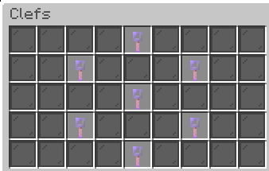
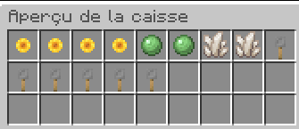
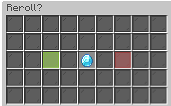

# Crates

<figure><figcaption></figcaption></figure>

Toutes les clés que vous recevrez sont virtuelles mais cela ne veut pas dire que vous ne pouvez pas les retirer pour les vendre au auction house.\
\
Le système est super simple à utiliser : \
Clic gauche pour ouvrir 1 clé\
Clic droit pour ouvrir 10 clés \
Clic Molette pour ouvrir 100 clés \
Maintenez Maj et faites un clic gauche pour ouvrir toutes vos clés


Si vous avez le grade démon, vous aurez la chance de reroll vos récompenses


<figure><figcaption></figcaption></figure>

<figure><figcaption></figcaption></figure>

| Commande                            | Description                                                                                                  |
| ----------------------------------- | ------------------------------------------------------------------------------------------------------------ |
| /key                                | Permet d'ouvrir le menu des clés virtuelles où vous pouvez ouvrir vos crates                                 |
| /key withdraw \<crates> \<quantité> | Permet de retirer vos clés, les choix de crates sont: **commun, rare, epique, legendaire, mythique, divin.** |
| /key deposit                        | Permet de déposer les clés dans le menu virtuel pour pouvoir les ouvrir                                      |

&#x20;          \[ ] = optionnel                     < > = obligatoire
