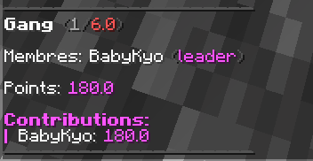
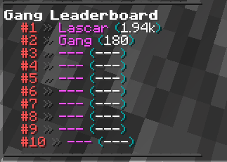

# Gang

Faire partie d'un gang est une étape importante dans votre jeu, sans quoi vous ne pouvez pas contrôler la zone de pvp ni même vous classer dans le leaderboard, ce qui vous prive de toutes les récompenses gratuites.

<figure><figcaption></figcaption></figure>

<figure><figcaption></figcaption></figure>

| Commande                            | Description                                                                           |
| ----------------------------------- | ------------------------------------------------------------------------------------- |
| /gang info  \[nom du gang / joueur] | Permet de voir toutes les informations relatives à un gang ou à un joueur spécifique  |
| /gang create \<nom du gang>         | Permet de créer votre gang                                                            |
| /gang disband                       | Permet de dissoudre le gang, attention cela ne peut pas être annulé.                  |
| /gang invite \<joueur>              | Permet d'inviter n'importe quel joueur à rejoindre votre gang                         |
| /gang uninvite \<joueur>            | Permet d'annuler une invitation déjà envoyée                                          |
| /gang leave \<Nom de votre gang>    | Permet de quitter son gang pour en rejoindre un autre                                 |
| /gang kick \<joueur>                | Permet d'expulser un joueur de votre gang, qui doit avoir un rang inférieur au vôtre. |
| /gang promote \<joueur>             | Permet de promouvoir un membre de votre gang                                          |
| /gang demote \<joueur>              | Permet de rétrograder un membre de votre gang                                         |
| /gang setleader \<joueur>           | Permet de désigner un joueur comme chef de gang                                       |
| /gang top                           | Permet de voir le top des gangs en cours                                              |

&#x20;          \[ ] = optionnel                     < > = obligatoire

