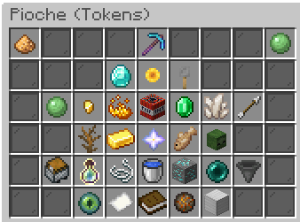

# Enchantement

<figure><figcaption></figcaption></figure>

<figure><figcaption></figcaption></figure>

Speed

Niveau Maximum: 5

Niveau de pioche Requis: 0

Prix total:

Remboursable: <mark style="color:green;">Oui</mark>

Night Vision

Niveau Maximum: 1

Niveau de pioche Requis: 0

Prix total:

Remboursable: <mark style="color:green;">Oui</mark>

Jump

Niveau Maximum: 5

Niveau de pioche Requis: 0

Prix total:

Remboursable: <mark style="color:green;">Oui</mark>

Haste

Niveau Maximum: 5

Niveau de pioche Requis: 0

Prix total:

Remboursable: <mark style="color:green;">Oui</mark>

Fortune

Niveau Maximum: ∞

Niveau de pioche Requis: 0

Prix total: ∞

Remboursable: <mark style="color:red;">Non</mark>

Token Finder

Niveau Maximum: 5,000

Niveau de pioche Requis: 0

Prix total:

Remboursable: <mark style="color:green;">Oui</mark>

Key Finder

Niveau Maximum:

Niveau de pioche Requis:&#x20;

Prix total:

Remboursable: <mark style="color:green;">Oui</mark>

Gem Finder

Niveau Maximum:

Niveau de pioche Requis:&#x20;

Prix total:

Remboursable: <mark style="color:green;">Oui</mark>

Lucky

Token Merchant

Nuke

Holy

