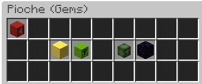

# Gems Enchant

<figure><figcaption></figcaption></figure>

Jackpot

Description: Possibilité de gagner des récompenses super OP

Niveau Maximum: 1

Niveau de pioche requis: 100

Prix total: 100M gems

Level Finder

Description: Possibilité de gagner des niveaux supplémentaires sur vos enchants

Niveau Maximum: 30

Niveau de pioche requis: 175

Prix total: 9B gems

Suicidal Minions

Description: Possibilité de faire apparaître des zombies explosifs.

Niveau Maximum: 1,000

Niveau de pioche requis: 200

Prix total: 1.27B gems

Black Hole

Description: Possibilité de faire apparaître un trou noir qui aspire les blocs.

Niveau Maximum: 100

Niveau de pioche requis: 300

Prix total: 1.31B gems

