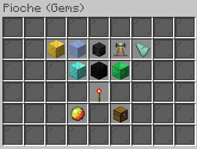

# Gems Enchant

<figure><figcaption></figcaption></figure>

Jackpot

Description

Niveau Maximum:

Niveau de pioche Requis:&#x20;

Prix total:

Remboursable: <mark style="color:green;">Oui</mark>

Icy

Description

Niveau Maximum:

Niveau de pioche Requis:&#x20;

Prix total:

Remboursable: <mark style="color:green;">Oui</mark>

Wild Wither

Description

Niveau Maximum:

Niveau de pioche Requis:&#x20;

Prix total:

Remboursable: <mark style="color:green;">Oui</mark>

Robot Finder

Description

Niveau Maximum:

Niveau de pioche Requis:&#x20;

Prix total:

Remboursable: <mark style="color:green;">Oui</mark>

Guardian

Description

Niveau Maximum:

Niveau de pioche Requis:&#x20;

Prix total:

Remboursable: <mark style="color:green;">Oui</mark>

Prosperity

Description

Niveau Maximum:

Niveau de pioche Requis:&#x20;

Prix total:

Remboursable: <mark style="color:green;">Oui</mark>

Black Hole

Description

Niveau Maximum:

Niveau de pioche Requis:&#x20;

Prix total:

Remboursable: <mark style="color:green;">Oui</mark>

Random Money

Description

Niveau Maximum:

Niveau de pioche Requis:&#x20;

Prix total:

Remboursable: <mark style="color:green;">Oui</mark>

Laser

Description

Niveau Maximum:

Niveau de pioche Requis:&#x20;

Prix total:

Remboursable: <mark style="color:green;">Oui</mark>

Rage

Description

Niveau Maximum:

Niveau de pioche Requis:&#x20;

Prix total:

Remboursable: <mark style="color:green;">Oui</mark>

Key All

Description

Niveau Maximum:

Niveau de pioche Requis:&#x20;

Prix total:

Remboursable: <mark style="color:green;">Oui</mark>

