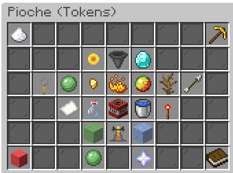

# Tokens Enchant

<figure><figcaption></figcaption></figure>

Speed

Description: Vous donne l'effet speed.

Niveau Maximum: 5

Niveau de pioche requis: 1

Prix total: 4,500 tokens

Haste

Description: Vous donne l'effet haste.

Niveau Maximum: 5

Niveau de pioche requis: 1

Prix total: 4,500 tokens

Token Finder

Description: Augmente la quantité de tokens que vous gagnez en minant

Niveau Maximum: 5,000

Niveau de pioche requis: 1

Prix total: 937.68B tokens

JackHammer

Description: Possibilité de briser une couche entière de votre mine

Niveau Maximum: 5,000

Niveau de pioche requis: 5

Prix total: 187.51T

Fortune

Description: Donne à votre pioche une chance de dupliquer vos blocs minés

Niveau Maximum: ∞

Niveau de pioche requis: 5

Prix total: ∞ tokens

Key Finder

Description: Donne à votre pioche une chance de gagner des clés supplémentaires

Niveau Maximum: 60

Niveau de pioche requis: 10

Prix total: 183T tokens

Gems Finder

Description: Donne à votre pioche une chance de gagner des gems

Niveau Maximum: 5,000

Niveau de pioche requis: 15

Prix total: 225.96T

Lucky

Description: Donne à votre pioche une chance de gagner des

Niveau Maximum: 50

Niveau de pioche requis: 25

Prix total: 130T

Token Merchant

Description:

Niveau Maximum:

Niveau de pioche requis: 30

Prix total:

Orbs Finder

Description:

Niveau Maximum:

Niveau de pioche requis: 40

Prix total:

Strike

Description:

Niveau Maximum:

Niveau de pioche requis: 50

Prix total:

Quake

Description:

Niveau Maximum:

Niveau de pioche requis: 60

Prix total:

Merchant

Description:

Niveau Maximum:

Niveau de pioche requis: 75

Prix total:

Plague

Description:

Niveau Maximum:

Niveau de pioche requis: 80

Prix total:

Nuke

Description:

Niveau Maximum:

Niveau de pioche requis: 100

Prix total:

Poseidon

Description:

Niveau Maximum:

Niveau de pioche requis: 125

Prix total:

Laser

Description:

Niveau Maximum:

Niveau de pioche requis: 150

Prix total:

Slime Splitter

Description:

Niveau Maximum:

Niveau de pioche requis: 175

Prix total:

Robot Finder

Description:

Niveau Maximum:

Niveau de pioche requis: 200

Prix total:

Icy

Description:

Niveau Maximum:

Niveau de pioche requis: 250

Prix total:

