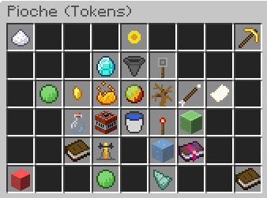

# Tokens Enchant

<figure><figcaption></figcaption></figure>

Speed

Description: Vous donne l'effet speed.

Niveau Maximum: 5

Niveau de pioche requis: 1

Prix total: 4,500 tokens

Haste

Description: Vous donne l'effet haste.

Niveau Maximum: 5

Niveau de pioche requis: 1

Prix total: 4,500 tokens

Token Finder

Description: Augmente la quantité de tokens que vous gagnez en minant

Niveau Maximum: 5,000

Niveau de pioche requis: 1

Prix total: 1.25T tokens

Fortune

Description: Donne à votre pioche une chance de dupliquer vos blocs minés

Niveau Maximum: 100K

Niveau de pioche requis: 5

Prix total: 125T tokens

JackHammer

Description: Possibilité de briser une couche horizontale entière de votre mine

Niveau Maximum: 5,000

Niveau de pioche requis: 5

Prix total: 187.51T

Key Finder

Description: Donne à votre pioche une chance de gagner des clés supplémentaires

Niveau Maximum: 60

Niveau de pioche requis: 10

Prix total: 183T tokens

Gems Finder

Description: Donne à votre pioche une chance de gagner des gems

Niveau Maximum: 5,000

Niveau de pioche requis: 15

Prix total: 225.96T

Lucky

Description: Donne à votre pioche une chance de gagner des récompenses

Niveau Maximum: 50

Niveau de pioche requis: 25

Prix total: 130T

Token Merchant

Description: Donne un boost de x2 Tokens gagnés par Token Finder durant 15 secondes

Niveau Maximum: 1,000

Niveau de pioche requis: 30

Prix total: 125.13T

Orbs Finder

Description: Donne à votre pioche une chance de gagner des orbs

Niveau Maximum: 1,000

Niveau de pioche requis: 40

Prix total: 184.9T

Strike

Description: Possibilité de déclencher un éclair qui produira une explosion

Niveau Maximum: 1,000

Niveau de pioche requis: 50

Prix total: 100.1T

Quake

Description: Possibilité de faire pleuvoir des flèches explosives

Niveau Maximum: 1,000

Niveau de pioche requis: 60

Prix total: 500.5T

Merchant

Description: Augmente la quantité de devise gagnez via fortune

Niveau Maximum: 1,000

Niveau de pioche requis: 75

Prix total: 125.08T

Plague

Description: Possibilité de faire apparaître une chauve-souris qui lancera des TNT

Niveau Maximum: 2,000

Niveau de pioche requis: 80

Prix total: 403.8T

Nuke

Description: Possibilité de briser l'ensemble de votre mine

Niveau Maximum: 500

Niveau de pioche requis: 100

Prix total: 1.5Q

Poseidon

Description: Invoque le trident de Poséidon depuis le ciel et explose en poisson, faisant exploser la mine

Niveau Maximum: 500

Niveau de pioche requis: 125

Prix total: 985.63T

Laser

Description: Possibilité de briser une couche verticale entière de votre mine

Niveau Maximum: 1,000

Niveau de pioche requis: 150

Prix total: 10.09Q

Slime Splitter

Description: Chance d'invoquer un gros slime qui explosera en slimes plus petits

Niveau Maximum: 1,000

Niveau de pioche requis: 175

Prix total: 24.99Q

Prestige Finder

Description: Vous permets de gagner des prestiges

Niveau Maximum: 1,000

Niveau de pioche requis: 185

Prix total: 375.63Q

Robot Finder

Description: Vous donne la chance de trouver des robots durant le minage

Niveau Maximum: 50

Niveau de pioche requis: 200

Prix total: 66.25Q

Icy

Description: Possibilité de remplacer certains blocs de la couche par des blocs de glace

Niveau Maximum: 1,000

Niveau de pioche requis: 250

Prix total: 50.95Q

Prestige Booster

Description: Donne un boost de 15 secondes durant lequel votre Prestige Finder sera en x2

Niveau Maximum: 350

Niveau de pioche requis: 275

Prix total: 46.16Q

